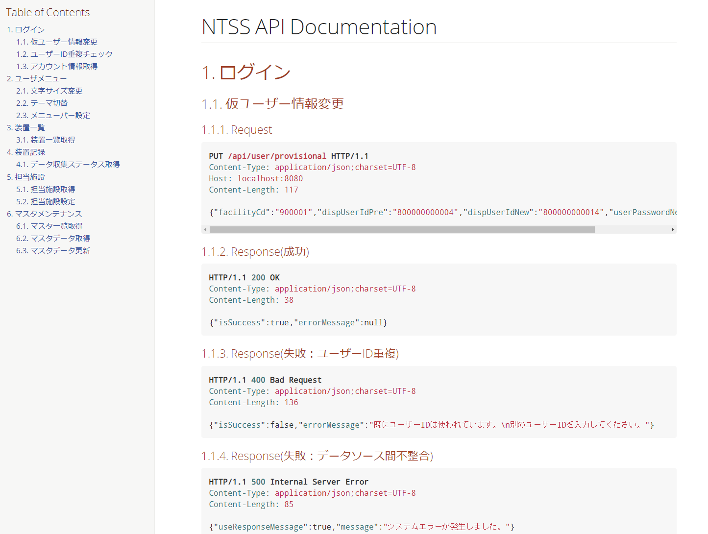

# Spring REST DocsでのAPI仕様書生成手順

[Spring REST Docs](https://spring.io/projects/spring-restdocs)を用いて以下のようなAPI仕様書を生成する手順を説明します。


## テストクラスの対応
- テストクラスを`AbstractResourceIntegrationTest`から継承する
  - 基底クラスで`mockMvc`インスタンスを`protected`で持っているので、サブクラスではこれを使う
  - API実行結果の検証時に、以下のようにしてリクエスト/レスポンスの説明を記述する(`andDo`以降)
```java
    // 検証
    result.andExpect(status().isOk())
      .andExpect(jsonPath("$.isSuccess", is(true)))
      .andExpect(jsonPath("$.errorMessage", nullValue()))
      .andDo(document("user_settings/font_size/ok",
          requestFields(
              fieldWithPath("userId").description("[必須]ユーザーID(内部)"),
              fieldWithPath("fontSize").description("[必須]文字サイズ(0:小～3:特大)"))
        ));
```
  - `document`メソッドの第1引数が生成されるファイルの格納先指定
    - 上記の例だと`build/generated-snippets/user_settings/font_size/ok`になる

## API仕様書（１つのAPI）のAsciiDocファイルを作成
上記の対応だけだと仕様書の断片しか生成されないので、API仕様書として1ファイルにまとめるためのAsciiDocファイルを生成する
- ファイル格納先は`ntss-admin-web/src/docs/asciidoc`
  - サンプルは以下(alterFontSize.adoc)
```adoc
[[alter-font-size]]
=== 文字サイズ変更

==== Request
include::{snippets}/user_settings/font_size/ok/http-request.adoc[]

==== Response(成功)
include::{snippets}/user_settings/font_size/ok/http-response.adoc[]

==== Response(失敗：文字サイズ指定不正)
include::{snippets}/user_settings/font_size/bad-request1/http-response.adoc[]

==== Response(失敗：該当ユーザーIDなし)
include::{snippets}/user_settings/font_size/bad-request2/http-response.adoc[]

==== Request Fields
include::{snippets}/user_settings/font_size/ok/request-fields.adoc[]

==== Response Fields
include::{snippets}/user_settings/font_size/bad-request1/response-fields.adoc[]
```

## API仕様書（API全部）のAsciiDocファイルへ追記
API仕様書を１つのHTMLですべて出力するために、上記で作成したAsciiDocファイルをindex.adocに記載します。

```
= NTSS API Documentation
:doctype: book
:page-layout!:
:toc: left
:toclevels: 2
:sectanchors:
:sectlinks:
:sectnums:
:linkattrs:
:source-highlighter: highlightjs

== ログイン
include::{snippets}/alterProvisionalInfo.adoc[]
include::{snippets}/isDuplicateDispUserId.adoc.adoc[]

== ユーザメニュー
include::{snippets}/alterFontSize.adoc[]
```

## API仕様書の生成
- `develop/repository/ntss`に移動し、`./gradlew apiDoc`を実行する
- ユニットテストが動いた後、`build/api-docs/html5`にhtml形式でAPI仕様書が生成される

## 注意事項
### リクエストにパスパラメータが含まれる場合
リクエストにパスパラメータが含まれる場合、API実行を以下のように修正する必要があります。
```diff
 // API実行
-ResultActions result = mockMvc.perform(request(HttpMethod.GET, "/api/user/check/{userId}/{dispUserId}", userId, dispUserId));
+ResultActions result = mockMvc.perform(RestDocumentationRequestBuilders.get("/api/user/check/{userId}/{dispUserId}", userId, dispUserId));
```