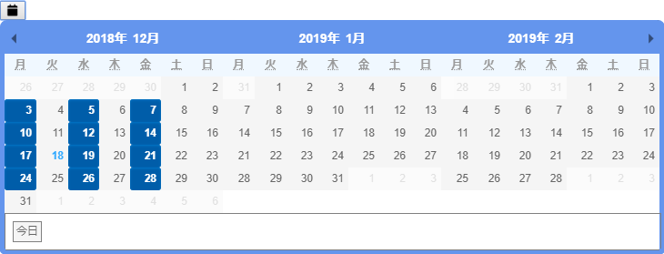

# 概要

標準のカレンダーの拡張。
複数の月から日付を選択できるコントロール。

## イメージ


## 機能

-   １つ目のカレンダーの左側に「<」ボタンを配置する。クリックで－１か月。
    表示月が「9月～11月」の場合、「<」クリックすると「8月～10月」となる。
    ※ スクロール可能
-   最後のカレンダーの左側に「>」ボタンを配置する。クリックで＋１か月。
    表示月が「9月～11月」の場合、「>」クリックすると「10月～12月」となる。
    ※ スクロール可能
-   何か月表示するか設定が可能
-   日付のクリック可/不可設定
-   曜日順：月、火、水、木、金、土、日

# 基本的な使い方

```javascript
<date-picker v-model="inputDate"
  :selected-dates="selectedDates"
  :disabled-dates="disabledDates"
/>

...

import CustomCalendar from "@/components/common/custom-calendar/CustomCalendar";

components: {
    "date-picker": CustomCalendar
},

data() {
  return {
    selectedDates: [
      '20181203',
      '20181205',
      '20181207',
      '20181210',
      '20181212',
      '20181214',
      '20181217',
      '20181219',
      '20181221',
      '20181224',
      '20181226',
      '20181228',
    ],
    disabledDates: [
      '20181229',
      '20181230',
      '20181231',
    ],
    inputDate: '',
  },
}

```

# Props

**value** `String`

* 選択された日付(v-model用)

**disabledDates** `Array`

* 選択無効日付(yyyyMMdd)

**disabledWeekdays** `Array`

* 選択無効曜日
* 月：1、火：2、水：3、木：4、金：5、土：6、日：7
* 例：月水金を無効にする場合、[1,3,5]

**numberOfMonths** `Number`

* 表示する月数
* デフォルト：1
 * 例：「2」を指定した場合、「当月」と「翌月」が表示される

**selectedDates** `Array`

* イベントがある日付(yyyyMMdd)
* カレンダーの該当日付に色が付け、透析予定日や検査予定日などのイベントがあることを示す

## 参照
[Pikaday](https://github.com/Pikaday/Pikaday)