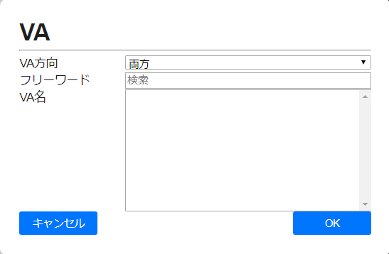

# マスタ選択

項目選択の共通I/Fを作成する
* VA
* ダイアライザ
* 医療材料
* 薬剤
  etc..


## イメージ



## 詳細
### VA
DBのmst_vaテーブルより、VAの選択をする

 * VA方法（リストボックス）: 以下の項目から選択ができること(※()内の値はDB値。()は表示しない。）
	 * 　両方（0）
	 * 　左 （1）
	 * 　右 （2）
	 * 　なし（3）
	 * 　不明（-）

 * フリーワード（テキストボックス）
	 * 入力したキーワードが部分一致するものをVA名にリストアップする

* VA名（リスト）
	 * 　VA方向、フリーワードでフィルタリングした結果のリストを表示する
	 * 　表示した項目の選択ができる


## 基本的な使い方
```javascript
<pop-over
   v-bind="popoverData"
   @popover-close="closePopover"
   @popover-return="updateInput"
/>

...

import masterSelector from "@/components/common/master-selector/MasterSelector";

components: {
　"pop-over": masterSelector
},

data() {
  return {
    popoverData: {
      popoverVisible: false,
      popoverTitleHeader: '',
      popoverFilter: [],
      popoverContentLabel: '',
      popoverContentDataset: [],
      popoverContentSelected: {},
    },
    inputValue: '',
  },
},
methods: {
  closePopover() {
    this.popoverData.popoverVisible = false;
  },
  updateInput(data) {
    this.inputValue = data.text;
    this.popoverData.popoverContentSelected = data;

  },
}
```

## Props
**popoverVisible** `Boolean`
* 表示／非表示（true, false）

**popoverDisplayDirection** `String`
* 表示方向 ('up', 'down', 'left', 'right')

**popoverTitleHeader** `String`
* タイトル（VA選択、ダイアライザ選択、等）

**popoverFilter** `Object`
 - フィルタ条件・抽出条件
 - 「popoverFilterLabel」はフィルタラベル（VA方向、メーカ、等）
 - 「popoverFilterDataset」フィルタの選択肢
 -  中身は以下：

```
[　
　{
　　popoverFilterLabel: ' ',
　　popoverFilterDataset:
　　{
　　　{ text: ' ', value: ' ' },
　　　{ text: ' ', value: ' ' },
　　},
　},
　{
　　popoverFilterLabel: ' ',
　　popoverFilterDataset:
　　{
　　　{ text: ' ', value: ' ' },
　　　{ text: ' ', value: ' ' },
　　},
　},
]
```

 * 例：
```
[
　{
　　popoverFilterLabel: 'VA方向',
　　popoverFilterDataset:
　　{
　　　{ text: '両方', value: '0' },
　　　{ text: '左', value: '1' },
　　　{ text: '右', value: '2' },
　　　{ text: 'なし', value: '3' },
　　　{ text: '不明', value: '-' },　　　
　　}
　},
]
```

**popoverFilterDisabled** `Boolean`
 * フィルタ無効設定（すべてのフィルタに一律適用される。）
 * 「true」を設定した場合、選択不可となる。


**popoverContentLabel** `String`
 * フィルタした結果のラベル（VA名、ダイアライザ名、等）

**popoverContentDataset** `Array`
 * フィルタした結果の選択肢
 * AND条件でフィルタを行う
 * 「text」は表示テキスト（マスタでの名）
 * 「value」は`<input />`のvalue（マスタでの主キー・cd）
 * 「fnValue」は抽出用の値。中身は以下：
```
　{
　　「filterKey」: 「filterValue」,
　}
```

 * 「filterKey」は「popoverFilter」での「popoverFilterLabel」
 * 「filterValue」は「popoverFilter」での「popoverFilterDataset」の「value」
 * フィルタを複数設定する場合、「filterkey: filterValue」のセットをフィルタ数分設定する
 * popoverContentDataset」の中身は以下：
```
[
　{ text: ' ', value: ' ', fnValue: { filterKey: filterValue } },
　{ text: ' ', value: ' ', fnValue: { filterKey: filterValue } },
]
```
 - 例：
```
[
　{ text: '左手前腕内シャント化静脈', value: 2, fnValue: { VA方向: 1 }},
　{ text: '左手肘部内シャント化静脈', value: 3, fnValue: { VA方向: 1 }},
]
```

**popoverContentSelected** `Object`
 * 選択されたもの（表示で強調する）
 * 中身は以下：
```
{
　text: ' ',
　value: ' ',
　fnValue: ' '
}
```

 * 　　　　例：
```
{
　text: '左手前腕内シャント化静脈',
　value: 2,
　fnValue: { VA方向: 1 },
}
```

## イベント
**popoverClose**
 * ポップオーバが隠れてからのコールバック
 * ★　呼び出す元でpopoverVisibleの更新は必要

**popoverReturn**
 * ポップオーバで選択されたデータを返すコールバック
 * 戻り値は以下：
```
{
　text: ' ',
　value: ' ',
　fnValue: ' '
}
```
 * 例：
```
{
　text: '左手前腕内シャント化静脈',
　value: 2,
　fnValue: { VA方向: 1 },
}
```

## 参照
[Onsen UI Popover](https://ja.onsen.io/v2/api/vue/v-ons-popover.html)
