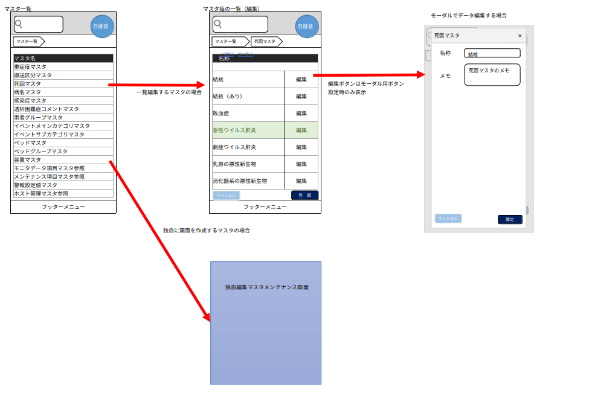

## マスタメンテナンスの概要
マスタメンテナンスは下記画面から構成されます。
* マスタ一覧画面
  * マスタの一覧が表示される画面。ログインユーザの権限により表示内容が変わる。
* マスタ編集画面
  * マスタ一覧から遷移したマスタを編集する画面

マスタメンテナンスの画面遷移に関しては以下参照  


## マスタメンテナンスのモード
マスタメンテナンスのモードは下記です。
* モード1:マスタ定義テーブルのカラム情報に定義することで自動でマスタ編集画面を生成するモード。
  * モーダル画面はモード1のカラム情報にモーダル起動用ボタンを定義することで遷移可能となる。
* モード2:モード1では範疇外となる独自に実装したマスタ編集画面を呼び出すモード。

## マスタ一覧定義方法
マスタの一覧は`マスタ定義テーブル（sys_master_define）`にて定義します。

### マスタ定義テーブル
マスタ定義テーブルへの設定方法を説明します。  
設定内容は下記のサンプルを参考にしてください。

* mode : 起動するマスタのモード
  * 1 : モード1、 2 : モード2
* disp_class : マスタの表示区分
  * 1 : 日機装社員のみ（マスタ一覧に非表示）、 2 : 一般（マスタ一覧に表示）
* edit_level : 表示管理レベル
  * 1 : 全てのユーザに表示、 2 : 管理者ユーザのみ表示
  * 3 : 日機装社員のみ表示、 4 : 日機装社員 かつ 管理者ユーザのみ表示
  * 上記以外 : 一覧に非表示
* column_info : 行編集マスタの場合にカラム情報を定義します（独自編集マスタの場合は不要）
  * JSON項目（typeとaliasは必須）
    * fields : column_infoの先頭に必ず必要
    <table class="tg">
      <tr>
        <th class="tg-0pky">プロパティー</th>
        <th class="tg-0pky">下階層</th>
        <th class="tg-0pky">概要</th>
        <th class="tg-0pky">設定値</th>
        <th class="tg-0pky">説明</th>
      </tr>
      <tr>
        <td class="tg-0pky" colspan="2" rowspan="10">type</td>
        <td class="tg-0pky" rowspan="10">カラムのタイプを設定（KendoUI上で設定した型で認識される）</td>
        <td class="tg-0pky">"string"</td>
        <td class="tg-0pky"></td>
      </tr>
      <tr>
        <td class="tg-0pky">"number"</td>
        <td class="tg-0pky"></td>
      </tr>
      <tr>
        <td class="tg-0pky">"date"</td>
        <td class="tg-0pky"></td>
      </tr>
      <tr>
        <td class="tg-0pky">"boolean"</td>
        <td class="tg-0pky"></td>
      </tr>
      <tr>
        <td class="tg-0pky">"json"</td>
        <td class="tg-0pky"></td>
      </tr>
      <tr>
        <td class="tg-0pky">"combo1"</td>
        <td class="tg-0pky">固有のコンボボックス使用時に設定（combo_dataへの設定が必須）</td>
      </tr>
      <tr>
        <td class="tg-0pky">"combo2" </td>
        <td class="tg-0pky">参照型コンボボックス使用時に設定（reference_combo_defへの設定が必須）</td>
      </tr>
      <tr>
        <td class="tg-0pky">"disp" </td>
        <td class="tg-0pky">`is_disp` 使用時に設定、削除コンボボックスがグリッドに表示される</td>
      </tr>
      <tr>
        <td class="tg-0pky">"del" </td>
        <td class="tg-0pky">`is_del`使用時に設定、グリッドに非表示となる（マスタに`is_del`カラムがある時に設定必須）</td>
      </tr>
      <tr>
        <td class="tg-0pky">"modal"</td>
        <td class="tg-0pky">モーダル画面使用時に設定、モーダル表示用ボタンが表示される</td>
      </tr>
      <tr>
        <td class="tg-0pky" colspan="2">title </td>
        <td class="tg-0pky">グリッドのヘッダに表示</td>
        <td class="tg-0pky">String値</td>
        <td class="tg-0pky"></td>
      </tr>
      <tr>
        <td class="tg-0pky" colspan="2" rowspan="2">alias </td>
        <td class="tg-0pky" rowspan="2">マスタのcodeとnameに設定</td>
        <td class="tg-0pky">"code" </td>
        <td class="tg-0pky">マスタのコード値とみなされる（bigserial型であることが前提）、グリッドに非表示となる（設定必須）</td>
      </tr>
      <tr>
        <td class="tg-0pky">"name" </td>
        <td class="tg-0pky">マスタの名称と見なされる、検索にて使用される、mst_selectorに設定される（設定必須）</td>
      </tr>
      <tr>
        <td class="tg-0pky" colspan="2">physical_name </td>
        <td class="tg-0pky">カラム物理名を設定</td>
        <td class="tg-0pky">String値</td>
        <td class="tg-0pky"></td>
      </tr>
      <tr>
        <td class="tg-0pky" colspan="2" rowspan="2">format </td>
        <td class="tg-0pky" rowspan="2">カラムのフォーマットを設定</td>
        <td class="tg-0pky">n9（9は任意の数値）</td>
        <td class="tg-0pky">小数点以下の桁数を設定</td>
      </tr>
      <tr>
        <td class="tg-0pky">yyyy/MM/dd </td>
        <td class="tg-0pky">日付型のフォーマットを設定（yyyy年MM月dd日なども可能）</td>
      </tr>
      <tr>
        <td class="tg-0pky" colspan="2">validation </td>
        <td class="tg-0pky">KendoUIのバリデーション</td>
        <td class="tg-0pky"></td>
        <td class="tg-0pky"></td>
      </tr>
      <tr>
        <td class="tg-0pky" rowspan="4"></td>
        <td class="tg-0pky">required </td>
        <td class="tg-0pky">必須項目</td>
        <td class="tg-0pky">"true"</td>
        <td class="tg-0pky">（未設定時はfalse）</td>
      </tr>
      <tr>
        <td class="tg-0pky">max </td>
        <td class="tg-0pky">最大値</td>
        <td class="tg-0pky">数値</td>
        <td class="tg-0pky"></td>
      </tr>
      <tr>
        <td class="tg-0pky">min </td>
        <td class="tg-0pky">最小値</td>
        <td class="tg-0pky">数値</td>
        <td class="tg-0pky"></td>
      </tr>
      <tr>
        <td class="tg-0pky">maxlength </td>
        <td class="tg-0pky">数値</td>
        <td class="tg-0pky">最大桁数</td>
        <td class="tg-0pky"></td>
      </tr>
      <tr>
        <td class="tg-0pky" colspan="2" rowspan="2">hidden</td>
        <td class="tg-0pky" rowspan="2">グリッド上の表示制御</td>
        <td class="tg-0pky">"true"</td>
        <td class="tg-0pky">グリッド上非表示にする</td>
      </tr>
      <tr>
        <td class="tg-0pky">"false"</td>
        <td class="tg-0pky">省略可</td>
      </tr>
      <tr>
        <td class="tg-0pky" colspan="2" rowspan="2">editable </td>
        <td class="tg-0pky" rowspan="2">グリッド上の編集制御</td>
        <td class="tg-0pky">"true"</td>
        <td class="tg-0pky">グリッド上編集不可にする</td>
      </tr>
      <tr>
        <td class="tg-0pky">"false"</td>
        <td class="tg-0pky">省略可</td>
      </tr>
      <tr>
        <td class="tg-0pky" colspan="2" rowspan="2">locked</td>
        <td class="tg-0pky" rowspan="2">グリッド上の固定列制御</td>
        <td class="tg-0pky">"true"</td>
        <td class="tg-0pky">グリッド上固定列にする</td>
      </tr>
      <tr>
        <td class="tg-0pky">"false"</td>
        <td class="tg-0pky">省略可</td>
      </tr>
    </table>
  * JSON項目
    * combos : combo_dataの先頭に必ず必要
    <table class="tg">
      <tr>
        <th class="tg-s268">プロパティー</th>
        <th class="tg-s268">下階層</th>
        <th class="tg-s268">概要</th>
        <th class="tg-0lax">設定値</th>
        <th class="tg-0lax">説明</th>
      </tr>
      <tr>
        <td class="tg-s268" colspan="2">physical_name</td>
        <td class="tg-s268">コンボデータを表示するカラム物理名を設定</td>
        <td class="tg-0lax"></td>
        <td class="tg-0lax"></td>
      </tr>
      <tr>
        <td class="tg-s268" colspan="2">values </td>
        <td class="tg-s268">コンボデータを設定</td>
        <td class="tg-0lax"></td>
        <td class="tg-0lax"></td>
      </tr>
      <tr>
        <td class="tg-0lax" rowspan="2"></td>
        <td class="tg-0lax">value </td>
        <td class="tg-0lax">レコードのコード値</td>
        <td class="tg-0lax">String値</td>
        <td class="tg-0lax"></td>
      </tr>
      <tr>
        <td class="tg-0lax">text </td>
        <td class="tg-0lax">コンボボックスに表示するテキスト</td>
        <td class="tg-0lax">String値</td>
        <td class="tg-0lax"></td>
      </tr>
    </table>
* reference_combo_def : 参照型コンボボックス（定義したテーブル物理名から生成）を使用する際に設定
  * JSON項目
    * combos : combo_dataの先頭に必ず必要
    <table class="tg">
      <tr>
        <th class="tg-s268">プロパティー</th>
        <th class="tg-s268">下階層</th>
        <th class="tg-s268">概要</th>
        <th class="tg-0lax">設定値</th>
        <th class="tg-0lax">説明</th>
      </tr>
      <tr>
        <td class="tg-s268" colspan="2">physical_name </td>
        <td class="tg-s268">target_table.referenced_columnで設定されるカラムの値を保持するカラム物理名</td>
        <td class="tg-0lax">String値</td>
        <td class="tg-0lax">動的コンボを設定するマスタに存在する</td>
      </tr>
      <tr>
        <td class="tg-s268" colspan="2">target_table </td>
        <td class="tg-s268"></td>
        <td class="tg-0lax"></td>
        <td class="tg-0lax"></td>
      </tr>
      <tr>
        <td class="tg-0lax" rowspan="4"></td>
        <td class="tg-0lax">name </td>
        <td class="tg-0lax">参照される（コンボとなって表示される）テーブル物理名</td>
        <td class="tg-0lax">String値</td>
        <td class="tg-0lax"></td>
      </tr>
      <tr>
        <td class="tg-0lax">referenced_column </td>
        <td class="tg-0lax">「コンボの値」を保持するカラム物理名（optionタグのvalueに設定される）</td>
        <td class="tg-0lax">String値</td>
        <td class="tg-0lax"></td>
      </tr>
      <tr>
        <td class="tg-0lax">display_column </td>
        <td class="tg-0lax">「コンボに表示する値」を保持するカラム物理名</td>
        <td class="tg-0lax">String値</td>
        <td class="tg-0lax"></td>
      </tr>
      <tr>
        <td class="tg-0lax">identifier </td>
        <td class="tg-0lax">参照されるマスタのprimary key、かつserialとなるカラム物理名</td>
        <td class="tg-0lax">String値</td>
        <td class="tg-0lax"></td>
      </tr>
    </table>

column_infoのサンプル
```
{
  "fields":
  [
    {"type": "del", "physical_name": "is_del"},
    {"type": "disp", "title": "削除", "physical_name": "is_disp"},
    {"type": "number", "alias": "code", "title": "テストコード", "physical_name": "hoge_cd"},
    {"type": "string", "alias": "name", "title": "テスト名", "validation": {"required": true, "maxlength": 80}, "physical_name": "hoge_name"},
    {"type": "number", "title": "整数項目", "validation": {"maxlength": 7}, "physical_name": "hoge_numeric"},
    {"type": "number", "title": "小数部あり項目", "format": "n2", "validation": {"max": 99999999.99, "min": 0.0}, "physical_name": "hoge_numeric2"},
    {"type": "date", "title": "日付項目", "format" : "yyyy年MM月dd日", "physical_name": "hoge_date"},
    {"type": "combo1", "title": "コンボボックス", "physical_name": "test_combo"},
    {"type": "modal", "title": "モーダル"},
  ]
}
```

combo_dataのサンプル
```
{
  "combos":
  [
    {
      "physical_name": "test_combo1",
      "values":
      [
        {"value": "1", "text": "テストコンボ1-１"},
        {"value": "2", "text": "テストコンボ1-2"},
        {"value": "3", "text": "テストコンボ1-3"}
      ]
    },
    {
      "physical_name": "test_combo2",
      "values":
      [
        {"value": "11", "text": "テストコンボ2-１"},
        {"value": "12", "text": "テストコンボ2-2"},
        {"value": "13", "text": "テストコンボ2-3"}
      ]
    }
  ]
}
```

reference_combo_defのサンプル
```
{
  "combos":
  [
    {
      physical_name: "mst_hoge"
      target_table: {
        name: "reference_column_name",
        referenced_column: "save_column_name",
        display_column: "display_column_name",
        identifier: "hoge_cd"
      }
    }
  ]
}
```

## mst_selectorについて
選択肢マスタについて説明します。

* `facility_cd`と`master_physical_name`の複合キー
* `order_settings`にマスタの並び順が格納される（マスタ保存時に自動生成）
  * マスタにて非表示としたレコードは格納対象から除外

order_settingsのサンプル（自動生成）
```
{
  "items":
  [
    {"code": 1, "name": "テスト名称1"},
    {"code": 5, "name": "テスト名称5"},
    {"code": 3, "name": "テスト名称3"},
    {"code": 7, "name": "テスト名称7"},
    {"code": 4, "name": "テスト名称4"},
    {"code": 6, "name": "テスト名称6"},
    {"code": 2, "name": "テスト名称2"}
  ]
}
```
