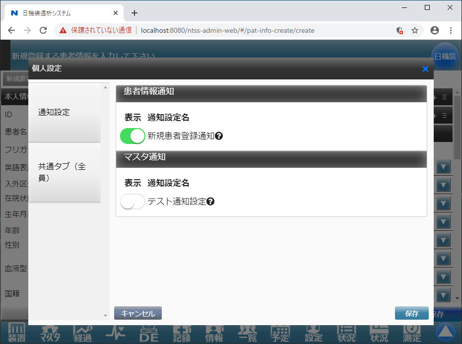

# 通知機能の対応について

## 1. 概要

各種操作を行った際などに、画面内での通知およびデスクトップ通知を行う際の対応方法について記載します。  

## 2. 実装方法

### 2-1. 通知定義テーブルへの登録方法

通知定義テーブル(`sys_notification`)に、通知するためのメッセージ情報と付加情報を定義します。  
テーブルに追加を行った際、データベース設計書の`@sys_notification`シートに追記をお願いします。

* 通知定義番号(notification_no): 通知定義テーブルに登録した該当の通知定義番号
* 通知カテゴリ(notification_category): 個人設定に画面表示する際に表示するカテゴリ  
  システム設定(`sys_system_define`)の管理番号12「通知カテゴリ設定」に対応しています。
    * 10 : 患者情報通知
    * 20 : 治療中通知
    * 30 : 患者イベント通知
    * 40 : 治療スケジュール通知
    * 50 : 施設イベント通知
    * 60 : 連携通知
    * 70 : マスタ通知
* 通知設定名(setting_name): 個人設定に画面表示する際の名称
* メッセージ定義(message): 実際に通知する際のメッセージ定義  
  定義内の`[]`で囲った部分を、置換可能なキーとして設定できます。  
  定義例：
  ```
  [PATNAME]さん退院しました。
  ```
* 付加情報定義(additional_info): URLダイレクト機能で使用する付加情報の定義  
  定義内の`[]`で囲った部分を、置換可能なキーとして設定できます。  
  定義例：
  ```
  {"FUNC": "004", "PATID": "[PATID]", "FACILITYCD": "[FACILITYCD]"}
  ```
* 表示順(disp_order): 通知カテゴリ内での表示順
* 使用可能キー(available_keys): メッセージ定義、付加情報定義で設定した、置換可能なキーの説明  
  定義例：
  ```
  [PATNAME]：患者名、[PATID]：内部患者ID、[FACILITYCD]：施設コード
  ```

### 2-2. 呼び出し方法（admin-web内）

画面から通知を発生させる場合は、`WebApiCallCommonUtil.registerNotification(Long notificationNo, String facilityCd, JSONObject replaceData)`を呼び出してください。

第一引数の`notificationNo`は、DBの`notification_no`カラムと対応しています。  
`jp.co.nikkiso.ntss.core.constant.CoreConstant.NotificationDefinition`に定数定義しております。

第二引数の`facilityCd`は、通知対象の施設コードを指定してください。  
第三引数の`replaceData`は、変換用キー、変換後の値の組み合わせを登録してください。  
対応するレコードの使用可能キーにあるキーをすべて指定してください。  
JSONで表現すると以下のような形式となります。
```json
{
  "PATNAME":"患者 テスト",
  "FACILITYCD":"009997",
  "PATID":"11"
}
```

※呼び出し方法サンプル
```Java
// 施設コード
String facilityCd = "009997";

// 通知メッセージ及び付加情報の変換用JSONデータを作成 値は文字列型にすること
JSONObject replaceData = new JSONObject();
replaceData.put("PATNAME", "患者 テスト");
replaceData.put("PATID", "11");
replaceData.put("FACILITYCD", "009997");

// 通知登録
webApiCallCommonUtil.registerNotification(NotificationDefinition.CREATE_PAT, facilityCd, replaceData);
```

### 2-3. 呼び出し方法（admin-web以外）

以下のURLに`POST`リクエストを投げてください。
```
http://localhost:8080/ntss-web-api/util/notificationReciever
```
※`localhost:8080` は環境によって変わります。呼び出し側の`yml`ファイルなどで指定できるようにしてください。

リクエストボディは以下のような形式のJSONを指定してください。
```json
{
  // 通知定義番号
  "notificationNo": 1,
  // 通知対象施設の施設コード
  "facilityCd": "009997",
  // 変換用データ(後述)をBase64エンコードしたもの
  "replaceData": "ew0KICAiUEFUTkFNRSI6IuaCo+iAhSDjg4bjgrnjg4giLA0KICAiRkFDSUxJVFlDRCI6IjAwOTk5NyIsDQogICJQQVRJRCI6IjExIg0KfQ=="
}
```

#### 変換用データについて

変換用データは、以下のJSONをBase64エンコードしたものを指定します。  
JSONには、変換用キー、変換後の値の組み合わせを登録してください。  
対応するレコードの使用可能キーにあるキーをすべて指定してください。  
エンコード時、**文字コードはUTF-8を指定してください。**  
（admin-webからweb-apiに日本語を送る必要があった為、このように実装しました）
```json
{
  "PATNAME":"患者 テスト",
  "FACILITYCD":"009997",
  "PATID":"11"
}
```

## 3. 付録

### 3-1. 処理の流れ

1. 事前準備として、通知を受け取る利用者の通知設定を有効にしておく
2. 各画面、および外部モジュールからweb-apiにある通知レシーバーにリクエストを送信する
3. 通知レシーバーにて、通知定義テーブルの内容と受信したリクエストの内容を元に通知メッセージを生成する
4. DBに通知メッセージ等を登録し、client-comm経由でブラウザ上に通知を発生させる
5. Web Pushを使用し、PC及びAndroidに対してプッシュ通知を送信する  
※iOSは現状非対応  
※ローカル環境でテストするためにはHTTPS化する必要あり（付録参照）

### 3-2. ローカル環境のHTTPS化

プッシュ通知までローカル環境でテストする場合、admin-webをHTTPS経由で接続する必要があります。  
以下にHTTPS化の方法を記載します。

1. 以下のサイトを参考に`.keystore`ファイルを作成します。
https://symfoware.blog.fc2.com/blog-entry-2079.html
2. 作成した`.keystore`ファイルを、`ntss-src/ntss-admin-web/`に配置します。
3. `application.yml`を編集し、`ssl:`部を追加します。
```
server:
  servlet:
    contextPath: /ntss-admin-web
  ssl:
    key-store: .keystore
    key-store-password: test01
    key-password: test01
```
4. chromeに以下の起動オプションを付けて起動します。（セキュリティ警告を無視するオプションです）  
```
--ignore-certificate-errors 
--unsafely-treat-insecure-origin-as-secure="https://localhost" 
--allow-insecure-localhost 
```
5. 以下のURLにアクセスします。  
https://localhost:8080/ntss-admin-web/#/?key=%242a%2410%24EXWsftyCEL7pYzTVAilGLOJKZ%2Fr4l%2Fa1JpHsMRbxPWKByjN.9sHNq  
DevToolsを開き、コンソールに`Welcome to Workbox!`と表示されればOKです。  
※`npm run serve`は使用できません。

### 3-3. 通知定義の有効化

個人設定 － 通知設定にて、利用者ごとに通知定義のON/OFFを切り替えられます。  
通知定義がONになっている利用者にのみ、通知が届きます。
